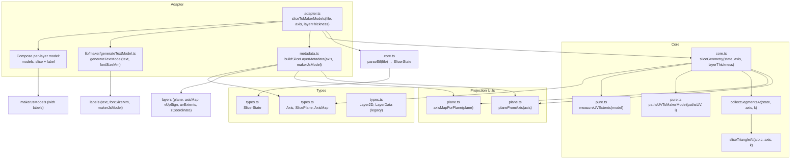

# Slicing Module Flow

This document describes the flow of the slicing pipeline across files in `src/slicing/` and related utilities.

## File References
- `src/slicing/adapter.ts`: entry point `sliceToMakerModels()`; enriches metadata and composes labels.
- `src/slicing/core.ts`: `parseStl()`, `sliceGeometry()` and helpers.
- `src/slicing/plane.ts`: plane and axis mapping utilities.
- `src/slicing/pure.ts`: UV projection to Maker.js models and extent measurement.
- `src/slicing/metadata.ts`: builds slice-layer metadata.
- `src/slicing/types.ts`: shared types.
- `src/lib/maker/generateTextModel.ts`: text label model generation.
