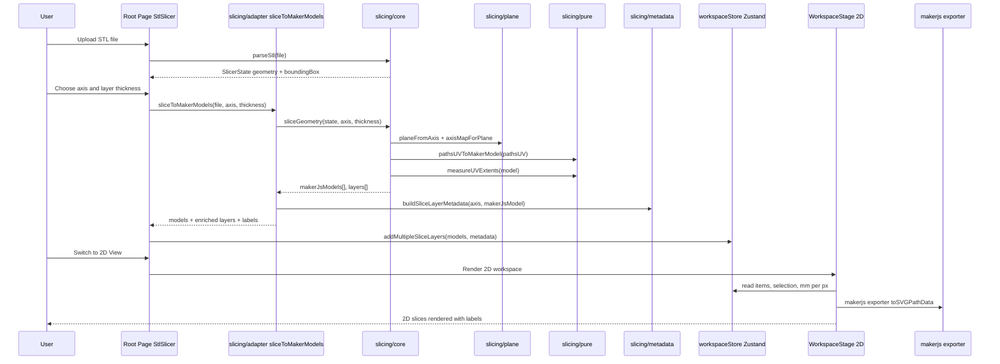
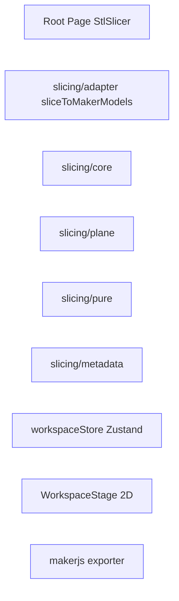

# Upload → Axis Select → 2D View

## Clickable Legend

## File References
- `src/components/StlSlicer.tsx` (root UI flow)
- `src/slicing/adapter.ts` (`sliceToMakerModels`)
- `src/slicing/core.ts` (`parseStl`, `sliceGeometry`)
- `src/slicing/plane.ts` (projection plane and axis map)
- `src/slicing/pure.ts` (UV to MakerJS model and extents)
- `src/slicing/metadata.ts` (layer metadata)
- `src/components/workspace/WorkspaceStage.tsx` (2D renderer)
- `src/store/workspaceStore` (Zustand store)
